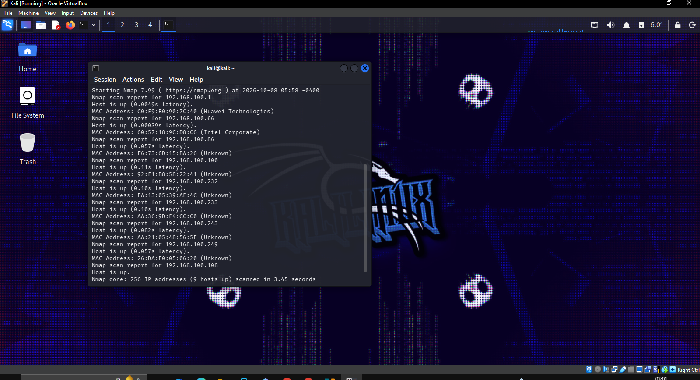
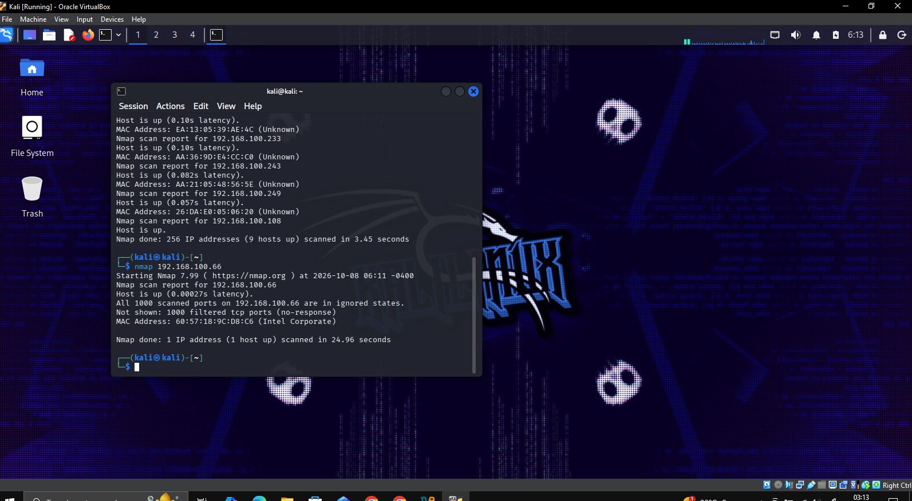
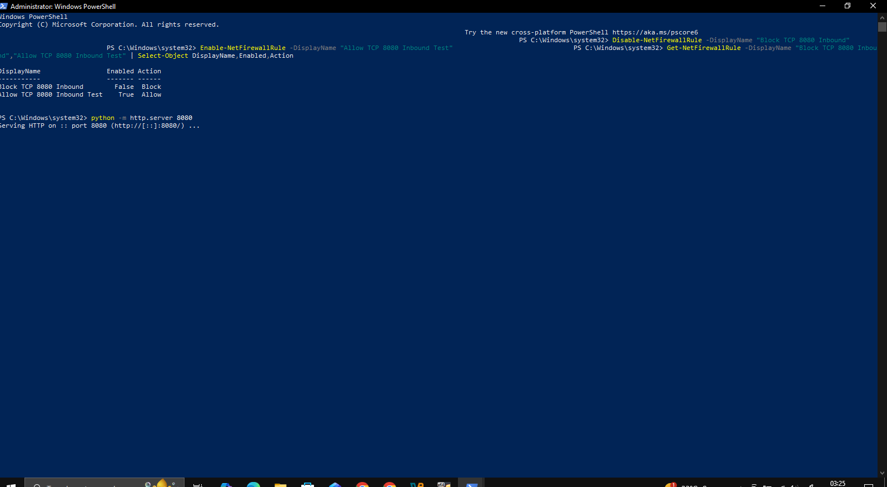
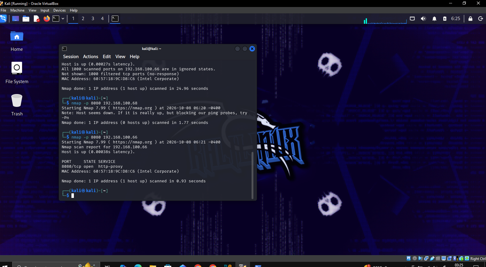
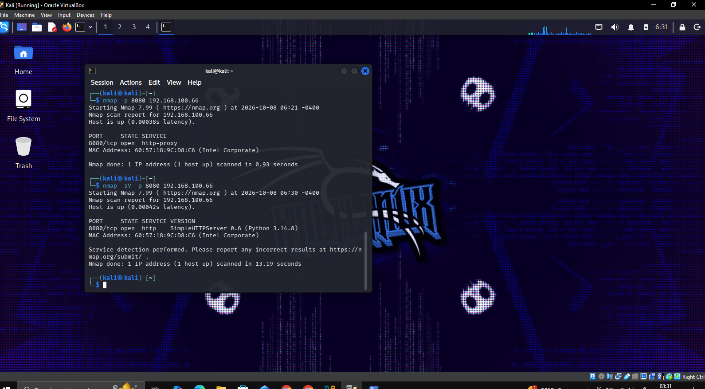

## Nmap Host Discovery

Kali Linux was connected to the local lab network with the IP address `192.168.100.108`.

Nmap host discovery was performed using:

`nmap -sn 192.168.100.0/24`

The scan discovered 9 active hosts on the local network.

## Nmap Basic Port Scan

A basic Nmap TCP port scan was performed against the authorized Windows lab machine at `192.168.100.66`.

The command used was:

`nmap 192.168.100.66`

Nmap confirmed that the host was online, but all 1000 default TCP ports were reported as filtered.

This indicated that the Windows Firewall was filtering the incoming scan traffic and preventing Nmap from receiving normal port responses.

## Nmap Open Port 8080 Test

A temporary Python HTTP server was started on Laptop 1 using TCP port `8080`.

Kali Linux then scanned TCP port `8080` on Laptop 1.

The command used was:

`nmap -p 8080 192.168.100.66`

Nmap reported:

`8080/tcp open`

This confirmed that port `8080` was reachable and a service was actively listening.

## Nmap Service Version Detection

Nmap service detection was performed against TCP port `8080`.

The command used was:

`nmap -sV -p 8080 192.168.100.66`

Nmap identified the service as:

`SimpleHTTPServer 0.6 (Python 3.14.8)`

This confirmed that a Python HTTP service was actively running on port `8080`.

